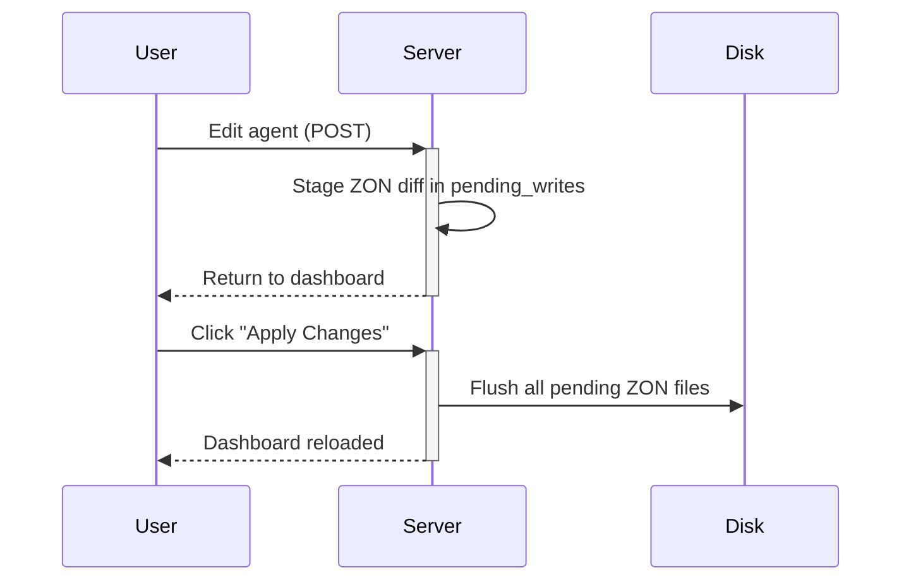

# gear_editor

Web-based player profile/state editor for Zenless Zone Zero private servers.

Reads and writes ZON-format state files directly on disk, shared with the [Yoshunko](https://github.com/...) game server — no sync layer, no API.

## Features

| Panel | Edit | Create | Delete | Card view |
|-------|------|--------|--------|-----------|
| Agents (avatars) | Level, rank, core skill, talents | No | No | Yes |
| W-Engines (weapons) | Level, rank, stars | Yes | No | Yes |
| Drive Discs | Main/sub stats, level, slot | Yes, seeded single | Yes | Yes |
| Bangboo | Level, rank, stars | No | No | Yes |
| Deadly Assault | Score per boss | No | No | Detail view |
| Shiyu Defense | Stage stars per frontier | No | No | Detail view |
| Client Updates | No | Upload patch .zip | Remove | File listing |

## Architecture

```
┌──────────────┐     ┌──────────────┐     ┌──────────────────┐
│   Browser    │────▶│ gear_editor  │────▶│ yoshunko/state/  │
│  (all HTML   │     │ (Rust+Axum)  │     │ player/{uid}/    │
│   inline)    │◀────│ localhost:   │◀────│ avatar/weapon/   │
│              │     │   3001       │     │ equip/buddy/     │
└──────────────┘     └──────┬───────┘     └──────────────────┘
                            │ (auth)
                     ┌──────▼───────┐
                     │   hoyo-sdk   │
                     │ (SQLite DB)  │
                     └──────────────┘
```

- **Rost + Axum 0.7** — no templating engine, all HTML generated via `format!()` in route handlers
- **Vanilla JS** — <50 lines total for dropdown cascading, image previews, mobile drawer
- **CSS inline** — no `.css` files; all styles in `<style>` blocks inside handlers
- **ZON parser/serializer** — custom `src/zon.rs` for the game's binary-like object notation
- **5 locales** — EN, RU, ZH, KR, JA (auto-detected from `Accept-Language` header)

### Edit flow

Edits are staged in memory (`pending_writes`) and committed to disk in one batch via the "Apply Changes" button. Creations (weapons, discs, bangboos) write immediately.



### Directory layout on disk

```
{GEAR_STATE_DIR}/player/{player_uid}/
  account/{uid}                    # account UID → player UID mapping
  avatar/{agent_id}                # each agent is a single ZON file
  weapon/{weapon_uid}              # each weapon is a single ZON file
  weapon/next                      # auto-increment UID counter
  equip/{equip_uid}                # each disc is a single ZON file
  equip/next                       # auto-increment UID counter
  buddy/{bangboo_uid}              # each bangboo is a single ZON file
  buddy/next                       # auto-increment UID counter
  hadal_zone/info                  # DA + Shiyu progress
```

## Quick Start

### Prerequisites

- Rust toolchain (nightly 2024 edition)
- [hoyo-sdk](https://github.com/...) — provides the SQLite DB for login
- [yoshunko](https://github.com/...) — provides state files to edit (optional; can edit standalone)

### Environment variables

| Variable | Default | Description |
|----------|---------|-------------|
| `GEAR_EDITOR_ADDR` | `127.0.0.1:3001` | Bind address |
| `GEAR_STATE_DIR` | `../yoshunko/state` | Beta game server state dir |
| `GEAR_STATE_DIR_PROD` | `../yoshunko_prod/state` | Prod game server state dir |
| `GEAR_ASSET_DIR` | `../yoshunko/assets/Filecfg` | Beta game asset files |
| `GEAR_ASSET_DIR_PROD` | `../yoshunko_prod/assets/Filecfg` | Prod game asset files |
| `HOYO_SDK_CONFIG` | `../hoyo-sdk/sdk_server.toml` | SDK config for login DB |
| `ZZZ_DUMP_DIR` | `../zzz_dump/latest` | Dump data for item names/icons |

The app expects this repo layout:

```
ZZZ_Server/
  gear_editor/          # this repo
  hoyo-sdk/             # SDK server (for auth)
  hoyo-sdk/sdk_server.toml
  yoshunko/             # game server
  yoshunko/state/       # player state files
```

### Build & run

```bash
# Dev build
cargo run

# Release build
cargo run --release

# Or use the provided startup script
bash scripts/start_gear_editor.sh
```

Open `http://127.0.0.1:3001` in a browser.

### Login

Use the same admin credentials as hoyo-sdk. Admin account is defined in `auth.rs` — by default the first user with username `admin` is the admin. Sessions persist for 30 days via `ge_session` cookie.

### Server switching

Use the "Beta / Prod" toggle in the header to switch between beta and production Yoshunko state directories. All pending edits are discarded on switch.

## Project Structure

```
src/
  main.rs          # App bootstrap, Router, dashboard HTML (~410 lines)
  app_state.rs     # AppState, ServerMode, cookie parsing
  auth.rs          # Session store, login validation
  config.rs        # SDK config loading
  assets.rs        # Static file serving (range requests, image cache)
  i18n.rs          # 5-locale translation table (~100 keys)
  player_state.rs  # UID resolution, stat select rendering
  updates.rs       # Client updates panel
  utils.rs         # Apply changes, shared CSS, SVG helpers
  zon.rs           # ZON format parser/serializer
  data/
    hakushin.rs    # Game data: names, icons from dump directories
    templates.rs   # JSON template loading (base stats)
  domain/
    discs.rs       # Drive disc stat definitions, validation
  routes/
    auth.rs        # Login page, login/logout/switch server
    avatar.rs      # Agent edit, update, cards, add-all
    weapon.rs      # Weapon edit/new, update, add, cards
    equip.rs       # Disc edit/new/generate/delete/lock, cards
    bangboo.rs     # Bangboo edit, update, add-all, cards
    challenges.rs  # Deadly Assault & Shiyu detail panels
    admin.rs       # Client update upload/delete
```

## Performance

- Release profile uses `lto = "fat"`, `codegen-units = 1`, `panic = "abort"`, `strip = "symbols"`
- Dashboard renders only the active tab server-side (other panels are lazy)
- Gzip compression on all responses (via `tower-http`)
- Images served with `Cache-Control: max-age=604800, immutable`
- Startup script rebuilds only when source files are newer than the binary

## Localization

| Locale | `Accept-Language` | Dump source |
|--------|-------------------|-------------|
| EN | `en` | nanoka.cc |
| RU | `ru` | honeyhunterworld.net |
| ZH | `zh` | nanoka.cc |
| KR | `ko` | nanoka.cc |
| JA | `ja` | nanoka.cc |

Game data (agent/weapon/disc/bangboo names) is loaded from language-specific JSON dumps under `{dump_dir}/{locale_code}/`. RU falls back to EN for missing data.

## License

MIT
